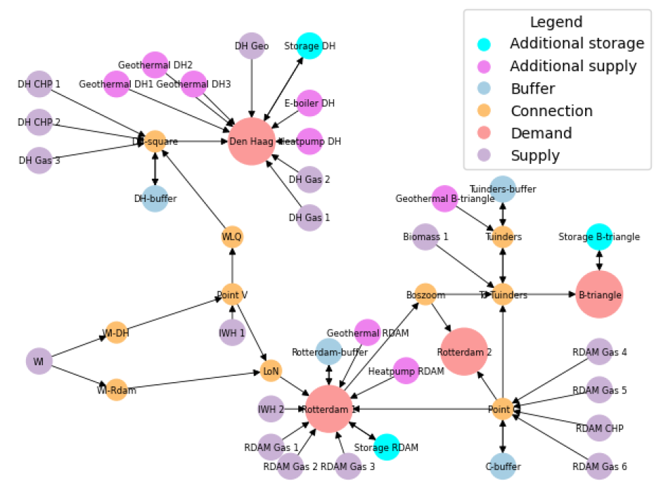
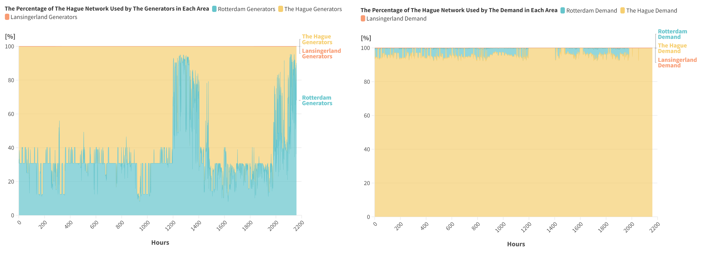
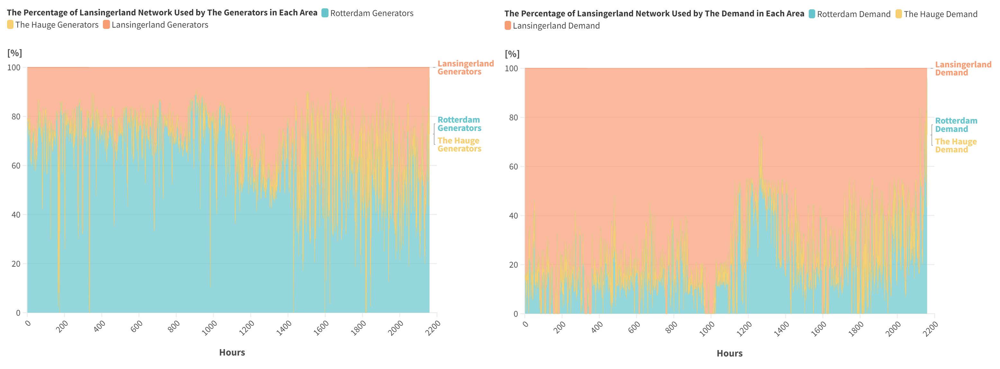
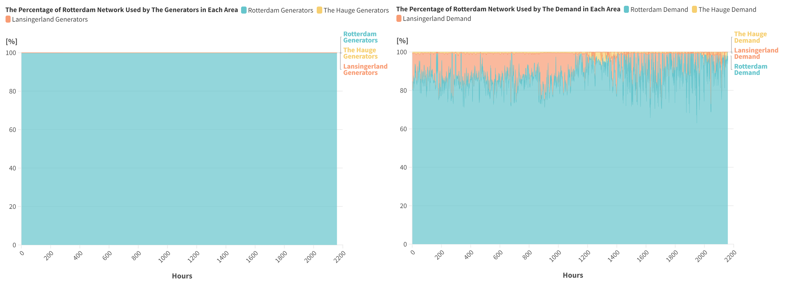

.. InfraFair documentation master file, created by Mohamed A.Eltahir Elabbas

##########################################
 Simple Heat Network: The Netherlands
##########################################

.. Note::
    You can `download <https://github.com/IIT-EnergySystemModels/InfraFair/tree/main/Examples/Simple_Heat_ex>`_ the data used in this example.

The network presented in this example represents the South-Holland District Heating Network (DHN) that connects the cities of Rotterdam, The Hague,   
and the region of Lansingerland (B-triangle). It is operated by Eneco and connects buildings (households, companies) to the waste heat of 
the Port of Rotterdam, waste incineration plants, steam and gas turbines, and heat buffers that function as heat storage. Some of the gas 
pipelines are bidirectional (with two arrows), while the majority are unidirectional, as shown in the Figure below.

   
The figure below shows the projected demand of the three cities in the first three months of 2030 (total of 2,160 hours). This total demand is supplied by
the 25 supply units using optimal economic dispatch (considering future fuel and CO2 prices, see the references). The map of flows
obtained from the optimal dispatch is used as input data to determine both the overall and hourly network utilisation.

.. image:: Images/Heat_Network_Demand.svg
   :scale: 70%
   :align: center

Running the Example
===================
To run the case, follow the following commands.

1. Launch the command prompt (Windows: Win+R, type "cmd", Enter) or the Anaconda prompt.
2. Set up the path to where code is located inside the repository cloned file, using the command::
   
        > cd "C:\Users\<username>\...\InfraFair\InfraFair".
3. Run the model with the following command::
  
        > python InfraFair.py
4. The model will ask you for the (<dir>) input, click Enter and leave it on the default value.
5. The model will ask you for the (<case>), enter the following command::
   
        > Input Case   Name (Default Examples\Simple_ex\Simple_Example): Examples\Simple_Heat_ex\Simple_Heat_Example
6. The model will ask you for the (<config_file>) input, click Enter and leave it on the default value.

Once the model finishes execution, the figure below should be displayed in the command or Anaconda prompt.

.. image:: Images/Execution.png
   :scale: 100%
   :align: center

Results
=======

The following table presents the overall flow (averaged equally across the 2,160 snapshots) created by the 
demand and generators, separately, in each network area. The diagonal flows represent the local flow created 
by the network users.

**Demand results**
 ================================ =========== =========== ============= 
 **Area**                         Rotterdam   The Hague   Lansingerland   
 -------------------------------- ----------- ----------- -------------
  Rotterdam Network               750.91      8.48        102.22                 
  The Hague Network               5           159.88      0.26                   
  Lansingerland Network           38.45       0           173.9                  
 -------------------------------- ----------- ----------- -------------
 **Flow Created by Other Demand** 110.7       5.26        38.45                  
 -------------------------------- ----------- ----------- -------------
 **Flow Created In Other Areas**  43.45       8.48        102.48                 
 -------------------------------- ----------- ----------- -------------
 **Net Flow**                     67.25       -3.22       -64.03                 
 ================================ =========== =========== ============= 

**Generation results**
 ==================================== =========== =========== ============= 
 **Area**                             Rotterdam   The Hague   Lansingerland   
 ------------------------------------ ----------- ----------- -------------
  Rotterdam Network                   861.06      0           0                 
  The Hague Network                   47.65       81.89       0                   
  Lansingerland Network               149.73      0           62.53                  
 ------------------------------------ ----------- ----------- -------------
 **Flow Created by Other generators** 0           47.65       149.73                  
 ------------------------------------ ----------- ----------- -------------
 **Flow Created In Other Areas**      197.39      0           0                 
 ------------------------------------ ----------- ----------- -------------
 **Net Flow**                         -197.39     47.65       149.73                 
 ==================================== =========== =========== ============= 

The figures below (obtained from the raw snapshot data using Flourish data visualization) illustrate the hourly network 
utilisation of each area by demand and generators.

It should be noted that while the demand of Rotterdam is expected to be fully supplied by its own generation 
(since the network of Rotterdam is fully used by its own generators) and does not make use of any other area 
network, the figures show that it makes slight use of the Hague network and considerable use of LansingerLand 
network. This is due to the fact that there is storage in Rotterdam that is treated as demand with negative 
production in hours of discharging and, hence, acts as a generator. This can be easily verified by inspecting 
the disaggregated results of individual agents and negative demand.

References
==========
For more details about the network used in this example, please refer to:

* Eva Colussi (2024). An integrated modeling approach to provide flexibility and
  sustainability to the district heating system in South-Holland, the Netherlands.
  `TU Delft Repository <http://resolver.tudelft.nl/uuid:d2edc481-9acd-41c3-877a-5ea0838d88c0>`_
