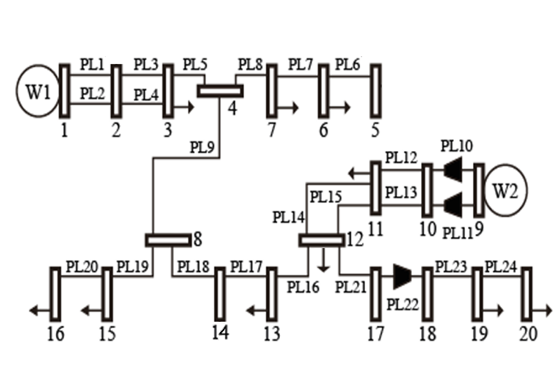
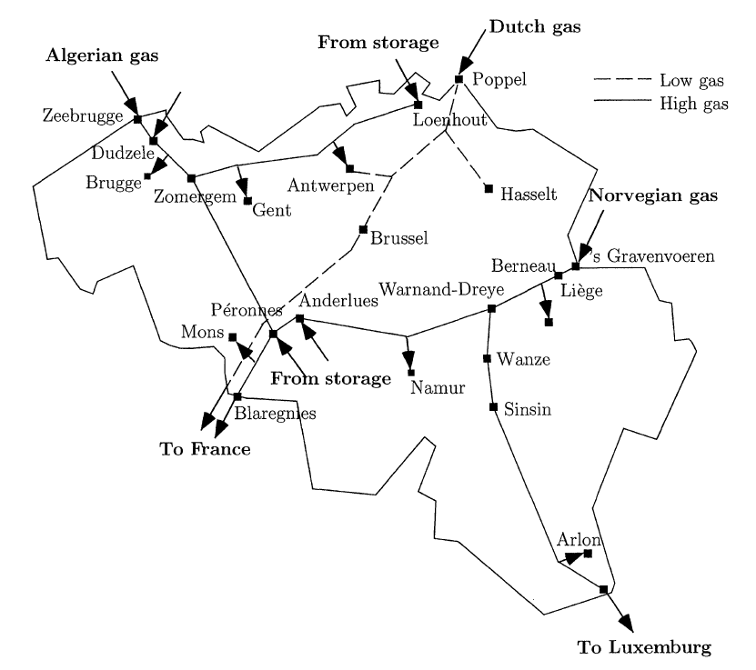
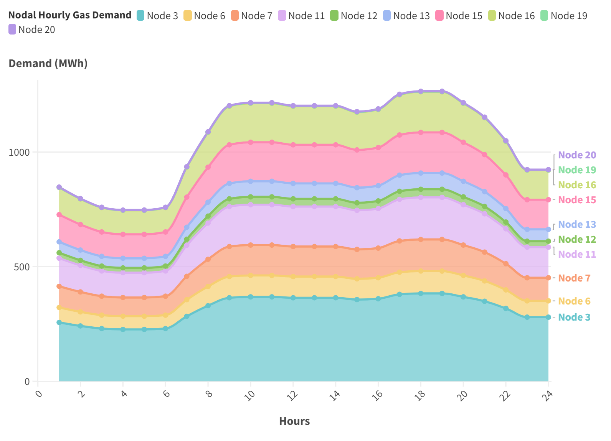
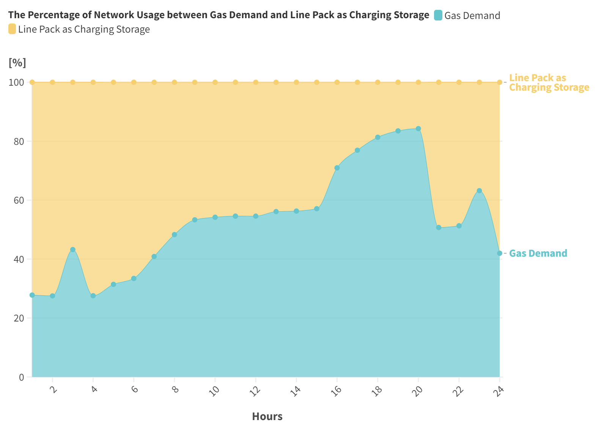
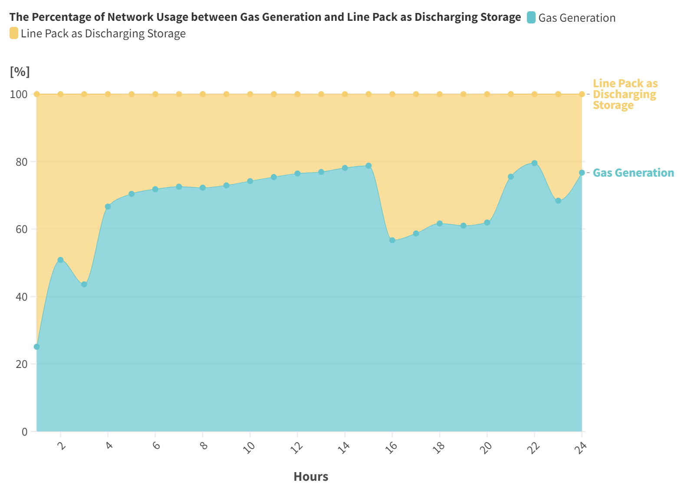

.. InfraFair documentation master file, created by Mohamed A.Eltahir Elabbas

####################################
 Simple Gas Network: Belgium
####################################

.. Note::
    You can `download <https://github.com/IIT-EnergySystemModels/InfraFair/tree/main/Examples/Simple_Gas_ex>`_ the data used in this example.

The network presented in this example represents an old snapshot of the Belgian high-calorific gas network that includes 
two main supplying units and 10 consumption nodes. There are 20 physical nodes in the network and 24 pipelines. However,
due to the storing capability of the gas pipelines (which is known as line pack), a virtual node was added for each pipeline to
model its storage. Exports and imports are ignored in this example.

The map of flows used in this example is obtained from an optimal dispatch of the system for a 24-hour period (For further details,
please see the references). The demand represented in the dispatch is temporally homogeneous across the node, as depicted in the 
figure below.

Running the Example
===================
To run the case, follow the following commands.

1. Launch the command prompt (Windows: Win+R, type "cmd", Enter) or the Anaconda prompt.
2. Set up the path to where code is located inside the repository cloned file, using the command::
   
        > cd "C:\Users\<username>\...\InfraFair\InfraFair".
3. Run the model with the following command::
  
        > python InfraFair.py
4. The model will ask you for the (<dir>) input, click Enter and leave it on the default value.
5. The model will ask you for the (<case>), enter the following command::
   
        > Input Case   Name (Default Examples\Simple_ex\Simple_Example): Examples\Simple_Gas_ex\Simple_Gas_Example
6. The model will ask you for the (<config_file>) input, click Enter and leave it on the default value.

Once the model finishes execution, the figure below should be displayed in the command or Anaconda prompt.

.. image:: Images/Execution.png
   :scale: 100%
   :align: center

Results
=======
The table below shows the overall total flow created in the network by the group of nodes. Generally, the line pack (virtual nodes that 
are denoted by storage) uses network as demand (charging period) more than as generation (discharging period).

**Overall results**
   ========================================== =================== ===================== ======================= ========================== 
   **Group of Nodes**                          Physical Demand     Charging Storage     Physical Generation     Discharging Storage    
   ------------------------------------------ ------------------- --------------------- ----------------------- -------------------------- 
   **Overall Total Flow Contribution (MWh)**  2759.71             2715.48               3687.44                 1776.23            
   ========================================== =================== ===================== ======================= ========================== 

The figures below (obtained from the raw snapshot data using Flourish data visualization) illustrate the hourly network 
utilisation by the demand, generation and line pack.

References
==========
For more details about the network used in this example, please refer to:

* De Wolf, D., & Smeers, Y. (2000). The gas transmission problem solved by an extension of 
  the simplex algorithm. Management Science, 46(11), 1454-1465. `JSTOR <https://www.jstor.org/stable/2661661>`_

* Correa-Posada, C. M., & Sanchez-Martin, P. (2014). Integrated power and natural gas model
  for energy adequacy in short-term operation. IEEE Transactions on Power Systems, 30(6), 3347-3355.
  `10.1109/TPWRS.2014.2372013 <https://doi.org/10.1109/TPWRS.2014.2372013>`_  
  