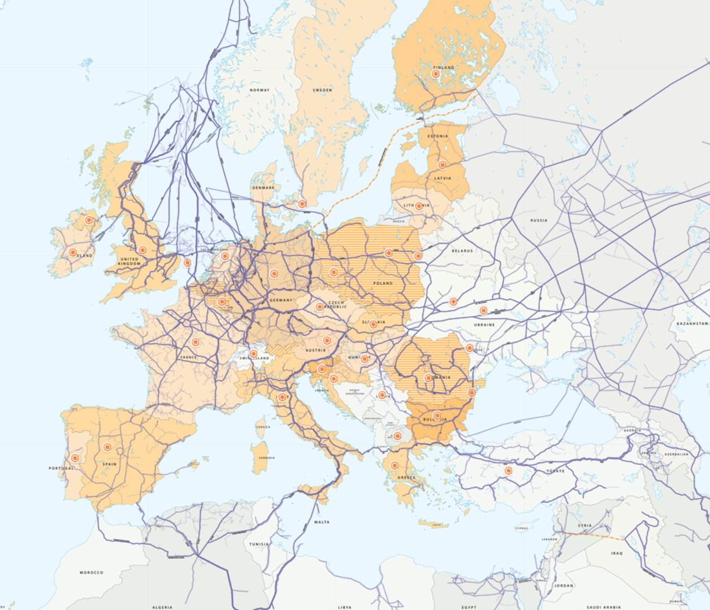
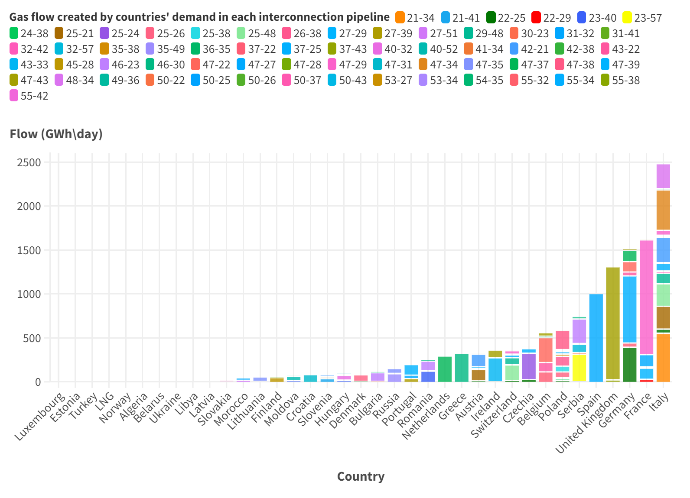
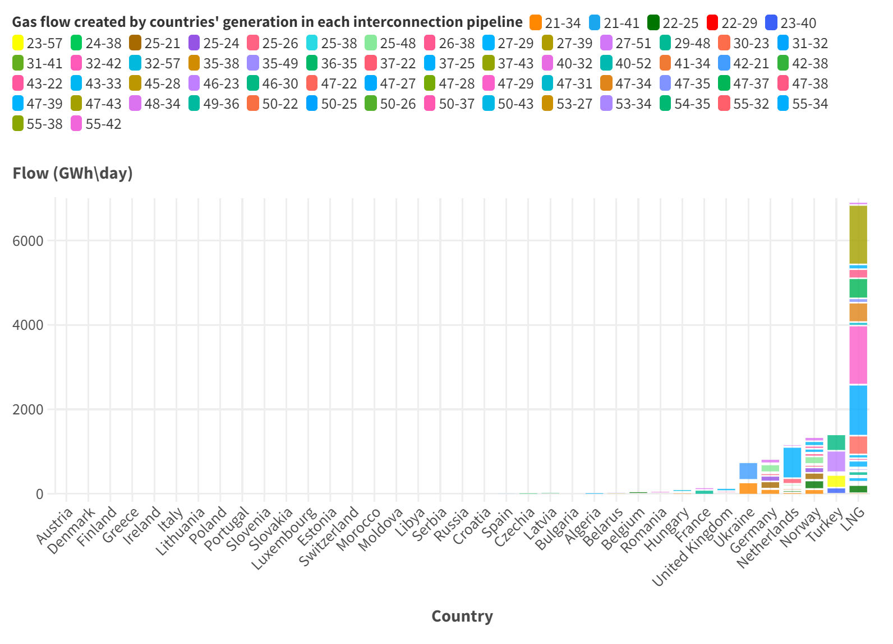
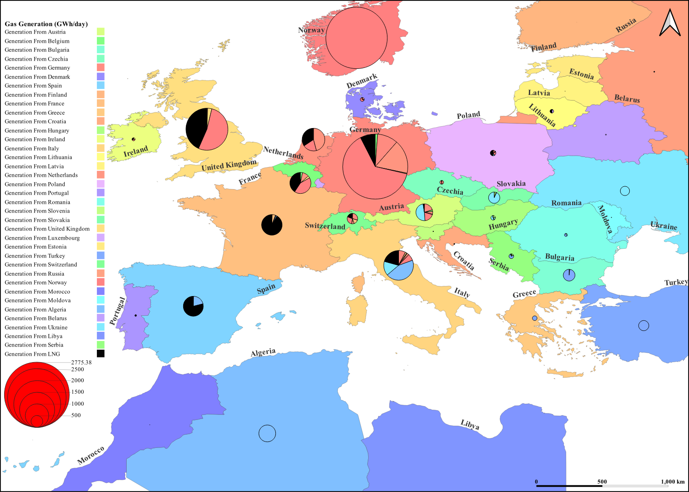

.. InfraFair documentation master file, created by Mohamed A.Eltahir Elabbas

####################################
 The EU Regional Gas Network
####################################

.. Note::
    You can `download <https://github.com/IIT-EnergySystemModels/InfraFair/tree/main/Examples/EU_Gas_ex>`_ the data used in this example.

The network presented in this example represents the European Regional Gas Network, which includes fifty-two countries in continental Europe
, four other countries, and Liquefied Natural Gas (LNG) terminals; each of which is represented by a single node, for a total of 57 nodes, 
with  63 interconnection pipelines. The example includes daily aggregated data (GWh/day) corresponding to the maximum gas demand day in 2022, 
which was December 13. 

The figure below is taken from ENTSO-G website (see references). It is assumed that interconnection pipelines belong 50%-50% to
the interconnected countries. In addition, this example does not take into account the effect of the line pack (the ability of the pipelines 
to store gas). Therefore, there could be a slight variation between inflows and outflows for some nodes (line pack could be treated as storage 
in the middle of the pipeline, see :doc:`17_Gas_example`, or as demand/generation split in half between the connected nodes).

Running the Example
===================
To run the case, follow the following commands.

1. Launch the command prompt (Windows: Win+R, type "cmd", Enter) or the Anaconda prompt.
2. Set up the path to where code is located inside the repository cloned file, using the command::
   
        > cd "C:\Users\<username>\...\InfraFair\InfraFair".
3. Run the model with the following command::
  
        > python InfraFair.py
4. The model will ask you for the (<dir>) input, click Enter and leave it on the default value.
5. The model will ask you for the (<case>), enter the following command::
   
        > Input Case   Name (Default Examples\Simple_ex\Simple_Example): Examples\EU_Gas_ex\EU_Gas_Example
6. The model will ask you for the (<config_file>) input, click Enter and leave it on the default value.

Once the model finishes execution, the figure below should be displayed in the command or Anaconda prompt.

.. image:: Images/Execution.png
   :scale: 100%
   :align: center

Results
=======
The two figures below show the total gas flow created by each country in each pipeline. The first figure shows the gas flow created 
by countries' demand (importing countries) while the second figure shows the gas flow created by countries' generation (exporting 
countries). 

The following figures show the geographical map of the countries and their network usage by other countries. The first figure shows for each 
country a pie chart showing the usage of that country's network by the demand of other countries, including its own demand. 

.. image:: Images/EU_Gas_D.png
   :scale: 5%
   :align: center

Similarly, the second figure shows a pie chart for each country showing the usage of that country's network by the generation 
of other countries, including its own generation.

Note that since this is a simplified network representation, each country's network consists only of the pipelines connecting 
that country to other countries. Also, note that significant gas flow from Ukraine and Belarus is actually transit gas coming from Russia 
(see references). Therefore, the network usage of the generation of these countries should be attributed mainly to Russia.

References
==========

For more details about the network used in this example, please refer to:

* `ENTSO-G <https://www.entsog.eu>`_