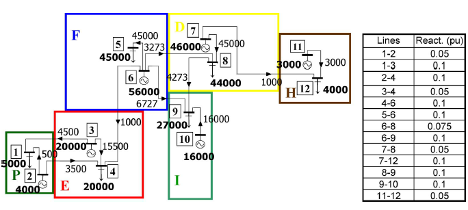

.. InfraFair documentation master file, created by Mohamed A.Eltahir Elabbas

##########################################
 Simple Example
##########################################

.. Note::
    You can `download <https://github.com/IIT-EnergySystemModels/InfraFair/tree/main/Examples/Simple_ex>`_ the 
    data used in this example.

InfraFair main function has default values that runs this example automatically by pressing enter when it asks for 
inputs. The network of this example is shown in the figure below. It consists of six countries, thirteen lines, 
six demand and six generations.

The basic output results consist of the tracked flow on each line to generators and demand, which are stored in the 
files *"Generation agents overall flow contribution per asset.csv"* and *"Demand agents overall flow contribution per asset.csv"*, 
respectively as shown in the tables below.

**Demand results**

============== ===== ====== ======= ====== ======= ====== ======= ============= ====== ====== ============= ====== ======= 
**Node**       1-2   1-3    11-12   2-4    3-4     4-6    5-6     6-8           6-9    7-12   7-8           8-9    9-10   
-------------- ----- ------ ------- ------ ------- ------ ------- ------------- ------ ------ ------------- ------ -------
1              500   4500   0       0      0       0      0       0             0      0      0             0      0      
2              0     0      0       0      0       0      0       0             0      0      0             0      0      
3              0     0      0       0      0       0      0       0             0      0      0             0      0      
4              0     0      0       3500   15500   1000   0       0             0      0      0             0      0      
5              0     0      0       0      0       0      45000   0             0      0      0             0      0      
6              0     0      0       0      0       0      0       0             0      0      0             0      0      
7              0     0      0       0      0       0      0       0             0      0      0             0      0      
8              0     0      0       0      0       0      0       2983.3        0      0      41016.7       0      0      
9              0     0      0       0      0       0      0       289.7         6727   0      3983.3        4273   16000  
10             0     0      0       0      0       0      0       0             0      0      0             0      0      
11             0     0      0       0      0       0      0       0             0      0      0             0      0      
12             0     0      3000    0      0       0      0       0             0      1000   0             0      0      
-------------- ----- ------ ------- ------ ------- ------ ------- ------------- ------ ------ ------------- ------ -------
**Total flow**  500   4500   3000    3500   15500   1000   45000   3273          6727   1000   45000         4273   16000  
============== ===== ====== ======= ====== ======= ====== ======= ============= ====== ====== ============= ====== ======= 

**Generators results**

============== ===== ====== ======= ====== ======= ====== ======= ====== ====== ====== ======= ============= ======= 
 **Node**       1-2   1-3    11-12   2-4    3-4     4-6    5-6     6-8    6-9    7-12   7-8     8-9           9-10   
-------------- ----- ------ ------- ------ ------- ------ ------- ------ ------ ------ ------- ------------- -------
 1              0     0      0       0      0       0      0       0      0      0      0       0             0      
 2              500   0      0       3500   0       0      0       0      0      0      0       0             0      
 3              0     4500   0       0      15500   0      0       0      0      0      0       0             0      
 4              0     0      0       0      0       0      0       0      0      0      0       0             0      
 5              0     0      0       0      0       0      0       0      0      0      0       0             0      
 6              0     0      0       0      0       1000   45000   3273   6727   0      0       289.7         0      
 7              0     0      0       0      0       0      0       0      0      1000   45000   3983.3        0      
 8              0     0      0       0      0       0      0       0      0      0      0       0             0      
 9              0     0      0       0      0       0      0       0      0      0      0       0             0      
 10             0     0      0       0      0       0      0       0      0      0      0       0             16000  
 11             0     0      3000    0      0       0      0       0      0      0      0       0             0      
 12             0     0      0       0      0       0      0       0      0      0      0       0             0      
-------------- ----- ------ ------- ------ ------- ------ ------- ------ ------ ------ ------- ------------- -------
**Total flow**  500   4500   3000    3500   15500   1000   45000   3273   6727   1000   45000   4273          16000  
============== ===== ====== ======= ====== ======= ====== ======= ====== ====== ====== ======= ============= ======= 

.. warning::
    Results are exported as .csv files because the format is faster than exporting them as .xlsx. However, the .csv 
    files automatically convert the data format of the cells. Therefore, the name of a line connecting two nodes with 
    ID numbers less than 12 will be automatically converted to date format. This is the case in this example. The header 
    that contains the name of the lines will be displayed as date; e.g., line 1-2 will be displayed as 2-Jan.
    
    To tackle this issue with the .csv files, the user can import the files into Excel using the Data -› From Text/CSV 
    option. During the import process, Excel will allow you to specify the data type for each column. Choose Text for 
    the column that contains values like 1-2. This tells Excel to treat the values in that column as text, and it will 
    not change them to dates.

For more details about this example, see:

* Olmos, L., & Perez-Arriaga, I. J. (2007). Evaluation of Three Methods Proposed for the 
  Computation of Inter-TSO Payments in the Internal Electricity Market of the European Union. 
  IEEE Transactions on Power Systems, 22(4), 1507–1522. `10.1109/TPWRS.2007.907118 <https://doi.org/10.1109/TPWRS.2007.907118>`_
