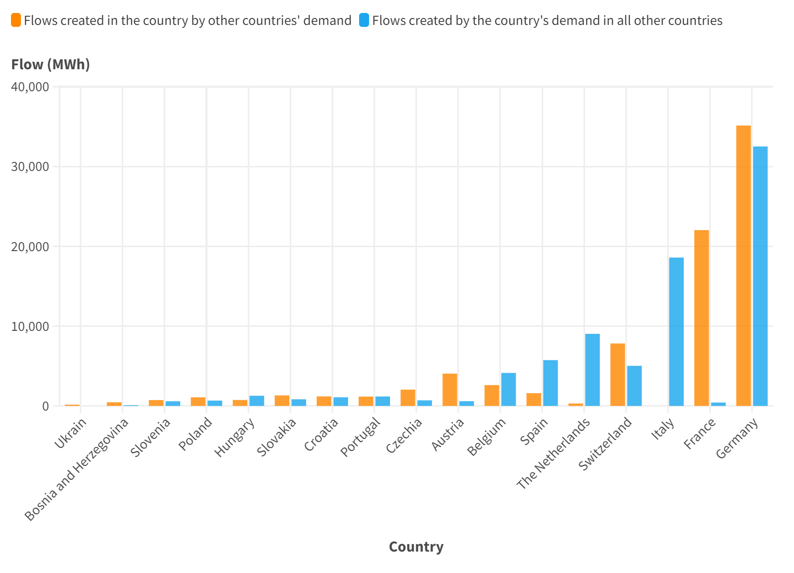
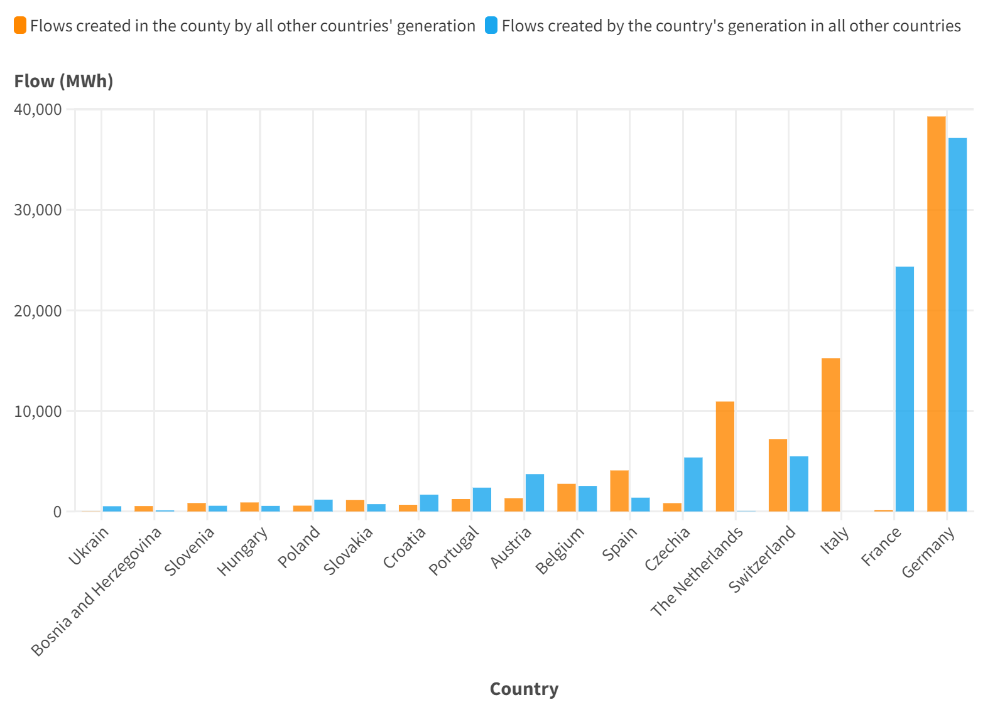

.. InfraFair documentation master file, created by Mohamed A.Eltahir Elabbas

##########################################
 The EU Regional Electricity Network
##########################################

.. Note::
    You can `download <https://github.com/IIT-EnergySystemModels/InfraFair/tree/main/Examples/EU_ex>`_ the data used in this example.

The network presented in this example represents an old snapshot of the European transmission network that includes 
eighteen countries, 3383 nodes and 5681 transmission lines. A single operational snapshot is used in this example to trace the flow.

Note that the data included in this example is meant for demonstration purposes and is by no means an accurate representation of the 
network. All the data included in the Assets attributes tab is artificial, and the cost figures are made up figures for testing purposes 
only. 

Running the Example
===================
To run the case, follow the following commands.

1. Launch the command prompt (Windows: Win+R, type "cmd", Enter) or the Anaconda prompt.
2. Set up the path to where code is located inside the repository cloned file, using the command::
   
        > cd "C:\Users\<username>\...\InfraFair\InfraFair".
3. Run the model with the following command::
  
        > python InfraFair.py
4. The model will ask you for the (<dir>) input, click Enter and leave it on the default value.
5. The model will ask you for the (<case>), enter the following command::
   
        > Input Case   Name (Default Examples\Simple_ex\Simple_Example): Examples\EU_ex\EU_Example
6. The model will ask you for the (<config_file>) input, click Enter and leave it on the default value.

.. Note::
    The Assets attributes tab **must include all the lines in the flow tab, including duplications**.

Once the model finishes execution, the figure below should be displayed in the command or Anaconda prompt.

.. image:: Images/Execution.png
   :scale: 100%
   :align: center

Results
=======
The following table shows the cost allocated to countries' generators (columns) based on their use of other countries' assets (rows).
The diagonal costs reflect the cost that a country has to pay itself according to the use of its own generators. 
The row "Cost to receive" indicates per country the total cost it should receive due to other countries' generators using
its assets (which is the sum of the country's row minus the cost it should pay itself).
The row "Cost to pay" indicates per country the total cost it should pay due to the use its generators are making of other 
countries' assets (which is the sum of the country's column minus the cost it should pay itself).

**Generation results**
 ==================== ======== ======== ======== ======== ======= ======== ======== ======= ======= ====== ======= ======= ======== ====== ======= ======= ======= ======= 
 **Country**           ZB       ZG       ZI       DB       DD       DE      DF       DI       DJ      EA      EB     EC      ED      EF       EG     EH      EI      FF     
 -------------------- -------- -------- -------- -------- ------- -------- -------- ------- ------- ------ ------- ------- -------- ------ ------- ------- ------- -------
  ZB                   236462   22598    4321     0        0       0        0        0       0       0      0       0       0        0      0       0       0       0      
  ZG                   499      18705    0        0        0       0        0        0       0       0      0       0       0        0      0       0       0       0      
  ZI                   723      0        599871   0        0       0        0        0       0       0      0       0       0        0      0       0       0       0      
  DB                   0        0        20149    214977   9491    93       1        0       0       543    1123    0       0        0      1628    420     0       0      
  DD                   0        0        7478     0        34546   3412     272      0       0       0      2563    0       0        0      0       0       0       0      
  DE                   0        0        12913    0        7977    246952   28756    0       0       0      4783    2450    0        0      0       0       0       0      
  DF                   0        0        1518     0        1094    13250    67513    0       0       0      0       1610    414      0      0       0       0       0      
  DI                   0        0        4884     0        0       0        12       82918   2562    0      0       0       0        0      0       0       0       0      
  DJ                   0        0        275      0        0       1788     18814    7210    54265   0      0       0       0        0      0       0       0       0      
  EA                   0        0        0        0        0       0        0        0       0       1809   1139    0       0        0      1181    117     0       0      
  EB                   0        0        0        0        0       531      0        0       0       0      29865   2553    0        0      0       47      473     0      
  EC                   0        0        0        0        0       0        0        0       0       0      0       1471    0        0      0       0       4       0      
  ED                   0        0        0        0        0       0        4520     0       0       0      0       0       206162   0      0       0       0       0      
  EF                   0        0        0        0        0       0        0        0       0       0      0       0       0        3151   1839    0       0       0      
  EG                   0        0        0        0        0       0        0        0       0       418    130     0       0        321    2831    132     0       0      
  EH                   0        0        0        0        0       0        0        0       0       0      31      102     0        0      0       15594   1554    675    
  EI                   0        0        0        0        0       0        0        0       0       0      0       1119    1038     0      0       0       15805   1010   
  FF                   0        0        0        0        0       0        0        0       0       0      0       0       0        0      0       392     4       241    
 -------------------- -------- -------- -------- -------- ------- -------- -------- ------- ------- ------ ------- ------- -------- ------ ------- ------- ------- -------
 **Cost to receive**   26919    499      723      33448    13725   56879    17886    7458    28087   2437   3605    4       4520     1839   1000    2361    3167    396    
 -------------------- -------- -------- -------- -------- ------- -------- -------- ------- ------- ------ ------- ------- -------- ------ ------- ------- ------- -------
 **Cost to pay**       1222     22598    51539    0        18563   19074    52374    7210    2562    960    9770    7834    1452     321    4647    1107    2036    1684   
 -------------------- -------- -------- -------- -------- ------- -------- -------- ------- ------- ------ ------- ------- -------- ------ ------- ------- ------- -------
 **Net compensation**  25698    -22099   -50816   33448    -4838   37804    -34488   248     25525   1477   -6165   -7829   3068     1518   -3647   1254    1131    -1288  
 ==================== ======== ======== ======== ======== ======= ======== ======== ======= ======= ====== ======= ======= ======== ====== ======= ======= ======= ======= 

Similarly, the following table shows the cost allocated to the countries' demand (columns) based on their use of other countries' assets (rows).

**Demand results**
 ===================== ======== ======= ======== ======== ======= ======== ======= ======= ======= ====== ======= ====== ======== ====== ====== ======= ======= =====
 **Country**            ZB       ZG       ZI      DB       DD       DE      DF       DI      DJ      EA      EB     EC      ED     EF       EG     EH     EI      FF     
 --------------------- -------- ------- -------- -------- ------- -------- ------- ------- ------- ------ ------- ------ -------- ------ ------ ------- ------- -----
  ZB                    262666   317     399      0        0       0        0       0       0       0      0       0      0        0      0      0       0       0    
  ZG                    1054     18150   0        0        0       0        0       0       0       0      0       0      0        0      0      0       0       0    
  ZI                    2600     0       584641   5763     1810    1057     10      4711    1       0      0       0      0        0      0      0       0       0    
  DB                    0        0       0        248425   0       0        0       0       0       0      0       0      0        0      0      0       0       0    
  DD                    0        0       0        14759    31659   1852     1       0       0       0      0       0      0        0      0      0       0       0    
  DE                    0        0       0        609      958     280593   18862   275     2535    0      0       0      0        0      0      0       0       0    
  DF                    0        0       0        238      56      20227    61440   175     2547    0      0       0      717      0      0      0       0       0    
  DI                    0        0       0        0        0       0        0       81576   8801    0      0       0      0        0      0      0       0       0    
  DJ                    0        0       0        0        0       0        0       5552    76799   0      0       0      0        0      0      0       0       0    
  EA                    0        0       0        712      0       0        0       0       0       3123   0       0      0        0      412    0       0       0    
  EB                    0        0       0        1780     1245    6726     11      0       0       1530   21966   0      0        0      195    17      0       0    
  EC                    0        0       0        0        0       853      100     0       0       0      521     0      0        0      0      1       0       0    
  ED                    0        0       0        0        0       0        413     0       0       0      0       856    207684   0      0      0       1729    0    
  EF                    0        0       0        0        0       0        0       0       0       0      0       0      0        4053   936    0       0       0    
  EG                    0        0       0        955      0       0        0       0       0       267    0       0      0        519    2090   0       0       0    
  EH                    0        0       0        284      0       0        0       0       0       13     429     0      0        0      520    16709   0       0    
  EI                    0        0       0        0        0       0        0       0       0       0      615     9      0        0      0      3318    15030   0    
  FF                    0        0       0        0        0       0        0       0       0       0      0       0      0        0      0      637     0       0    
 --------------------- -------- ------- -------- -------- ------- -------- ------- ------- ------- ------ ------- ------ -------- ------ ------ ------- ------- -----
 **Cost to receive**    716      1054    15952    0        16612   23237    23960   8801    5552    1124   11504   1476   2998     936    1742   1247    3942    637  
 --------------------- -------- ------- -------- -------- ------- -------- ------- ------- ------- ------ ------- ------ -------- ------ ------ ------- ------- -----
 **Cost to pay**        3653     317     399      25100    4069    30716    19396   10714   13883   1811   1566    865    717      519    2063   3974    1729    0    
 --------------------- -------- ------- -------- -------- ------- -------- ------- ------- ------- ------ ------- ------ -------- ------ ------ ------- ------- -----
 **Net compensation**   -2937    737     15553    -25100   12543   -7478    4563    -1913   -8330   -687   9939    611    2281     417    -321   -2727   2213    637  
 ===================== ======== ======= ======== ======== ======= ======== ======= ======= ======= ====== ======= ====== ======== ====== ====== ======= ======= ===== 

The figures below were created from the row results above using Flourish data visualization. They show the ranking of countries based on 
both their use of other countries' network and the use that other countries make of their network. 

