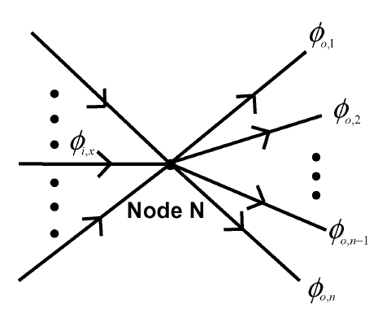
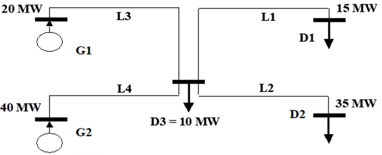

.. InfraFair documentation master file, created by Mohamed A.Eltahir Elabbas

##########################################
 Mathematical Formulation
##########################################

Average Participations Method
=============================

The method requires as its basic input data a collection of snapshots of the network energy flows corresponding 
to the specific system conditions of interest. The APM cost allocation algorithm assumes that energy flows can 
be traced —or the responsibilities for causing them can be assigned— by supposing that at any network node, 
the inflows are distributed proportionally among the outflows. This is the so-called **proportionality rule**. 
Implicit in this rule is the assumption that energy does not flow in the opposite direction to that of the 
prevalent (net) flow over each line, which, according to this assumption, is the only existing flow. Based on 
these assumptions, the method traces the flow of energy from individual sources to individual sinks. In 
other words, the model identifies, for each generator injecting energy into the network, physical paths starting 
at this generator node and go through the network until they reach certain demand nodes where they end. 
The method also works the other way around, thus identifying paths from a demand node to generator nodes. 
Those paths coincide with the ones starting from the generators. Therefore, the results of allocating the 
usage made of each element in the network to generators and demand when applying APM one way and the other 
are exactly the same. Besides, according to APM, the entire flow on each network element originates in some 
generators and ends in some demand, which means that, according to this method, the overall usage made of 
this network element by demand is the same as that made by generators. 
Lastly, the cost of each network element is allocated to the different network users according to 
how much energy is produced or consumed by each user flows along this network element. 

.. Note::
    Generally, APM treats a generator and demand located in the same node differently without assuming that the 
    generator supplies the demand first. Nevertheless, a variant of the method assumes that generators and demand 
    located at the same node will be treated on an aggregate base, either as a net generator or a net demand, depending 
    on their values. InfraFair provides both options for running the method (see the control input variables in :doc:`7_Input_Data`)

The proportionality rule
------------------------
The APM tracks the flows over the lines by following the actual flow of electromagnetic energy as given by 
the actual measures and splitting it at the junctions (nodes) in the same proportion as the actual flows do. 
Based on this, APM establishes a correspondence between incoming flows to each node and outflows from the node. 

The figure above depicts inflows to and outflows from node N. Inflows have been represented on the left of the 
node, whereas outflows are represented on the right. Notice that the power production at node N is an inflow 
to this node while the power consumption is an outflow from the node. The fraction of inflow :math:`\phi_{(i,x)}` 
that is deemed to be part of outflow :math:`\phi_{(o,y)}` is computed as the ratio of the size of the latter 
to the total amount of power flowing through node N. Thus, the contribution of inflow :math:`\phi_{(i,x)}` 
to outflows :math:`\phi_{(o,y)}` is calculated as follows:

.. math::
    C(\phi_{(i,x)},\phi_{(o,y)}) = \phi_{(i,x)} \frac{\phi_{(o,y)}}{\sum_{j=a}^{n} \phi_{(o,j)}}

Basic example
-------------
The figure below depicts a schematic representation of a network featuring four transmission lines and five nodes. 
G1 and G2 are two nodes where two generators inject power into the network. Nodes D1, D2 and D3 are three nodes 
where three demand withdraw power from the network.

Providing that all four transmission lines (L1, L2, L3, L4) can accommodate the power flows resulting from the 
unconstrained economic dispatch, the flow in each transmission line is tracked to generators and demands in the 
system, as shown in the table below.

===========  =======================  ===========================  ==============================  =============================
**Agent**    **Line 1**               **Line 2**                   **Line 3**                      **Line 4**                    
-----------  -----------------------  ---------------------------  ------------------------------  -----------------------------
**G1**       [15x20/(40+20)] = 5 MW   [35x20/(40+20)] = 11.7 MW    20 MW                           0 MW                       
**G2**       [15x40/(40+20)] = 10 MW  [35x40/(40+20)] = 23.3 MW    0 MW                            40 MW                         
-----------  -----------------------  ---------------------------  ------------------------------  -----------------------------
**Total**    **15 MW**                **35 MW**                    **20 MW**                       **40 MW**                         
-----------  -----------------------  ---------------------------  ------------------------------  -----------------------------
**D1**       15 MW                    0 MW                         [20x15/(10+15+35)] = 5 MW       [40x15/(10+15+35)] = 10 MW    
**D2**       0 MW                     35 MW                        [20x35/(10+15+35)] = 11.7 MW    [40x35/(10+15+35)] = 23.3 MW  
**D3**       0 MW                     0 MW                         [20x10/(10+15+35)] = 3.3 MW     [40x10/(10+15+35)] = 6.7 MW   
-----------  -----------------------  ---------------------------  ------------------------------  -----------------------------
**Total**    **15 MW**                **35 MW**                    **20 MW**                       **40 MW**                         
===========  =======================  ===========================  ==============================  =============================

Mathematical Equations
======================

From the previous equation, the flow in any line :math:`\phi` can be expressed as a linear function of the generation 
located at the sending bus of the line and the incoming flows to that bus. This is expressed in the following matrix 
equation:

.. math::
    \vec{\phi} = P^{out} \cdot \vec{\phi} + PG \cdot \vec{G}
    
:math:`P^{out} \equiv` matrix of unit contributions of inflows to outflows
    
:math:`PG \equiv` matrix of unit contributions of power injections to outflows
    
:math:`\vec{G} \equiv` vector of nodal power injection

The previous equation can be rearranged as follows:

.. math::
    \vec{\phi} = inv(1-P^{out}) \cdot PG \cdot \vec{G} = A^G \cdot \vec{G}

:math:`A^G \equiv` matrix of unit contributions of power injections to line flows

A similar formulation can be derived for the contributions of nodal power consumptions to line flows:

.. math::
    \vec{\phi} = inv(1-P^{in}) \cdot PD \cdot \vec{D} = A^D \cdot \vec{D}

:math:`P^{in} \equiv` matrix of unit contributions of outflows to inflows
    
:math:`PD \equiv` matrix of unit contributions of power withdrawals to inflows
    
:math:`\vec{D} \equiv` vector of nodal power withdrawal

:math:`A^D \equiv` matrix of unit contributions of power withdrawal to line flows

Once it is decided the fraction :math:`K_D` of the total cost of the network should be recovered from demand and which fraction
:math:`K_G` should be recovered from generators, line flows can be expressed as follows:

.. math::
    \vec{\phi} = K_G \cdot A^G \cdot \vec{G} + K_D \cdot A^D \cdot \vec{D}

Finally, the compensation that a country must pay each country in the region (including itself), for the use that 
generators and demand within the country are making of the grid of these countries, is computed as follows:

.. math::
    PAY_C = LO \cdot LC \cdot (K_G \cdot A^G \cdot NO_C \cdot \vec{G} + K_D \cdot A^D \cdot NO_C \cdot \vec{D})

:math:`PAY_C \equiv` vector of payments allocated to country C for its use of the network of each country
        
:math:`LC \equiv` the line cost matrix

:math:`LO \equiv` the line ownership matrix

:math:`NO_C \equiv` the nodal ownership matrix of country C

References
==========

For more details about the APM method, please refer to:

* Olmos, L., & Perez-Arriaga, I. J. (2007). Evaluation of Three Methods Proposed for the 
  Computation of Inter-TSO Payments in the Internal Electricity Market of the European Union. 
  IEEE Transactions on Power Systems, 22(4), 1507–1522. `10.1109/TPWRS.2007.907118 <https://doi.org/10.1109/TPWRS.2007.907118>`_

* Bialek. J. (1996). Tracing the flow of electricity. IEE Proc.-Gen. Transm. Distrib., Vol. 143, July 1996,
  pp. 313-320. `10.1049/ip-gtd:19960461 <https://doi.org/10.1049/ip-gtd:19960461>`_