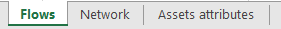
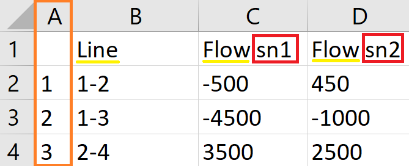
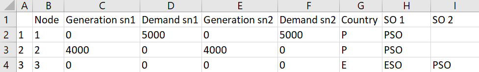
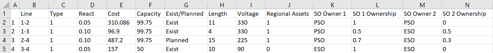
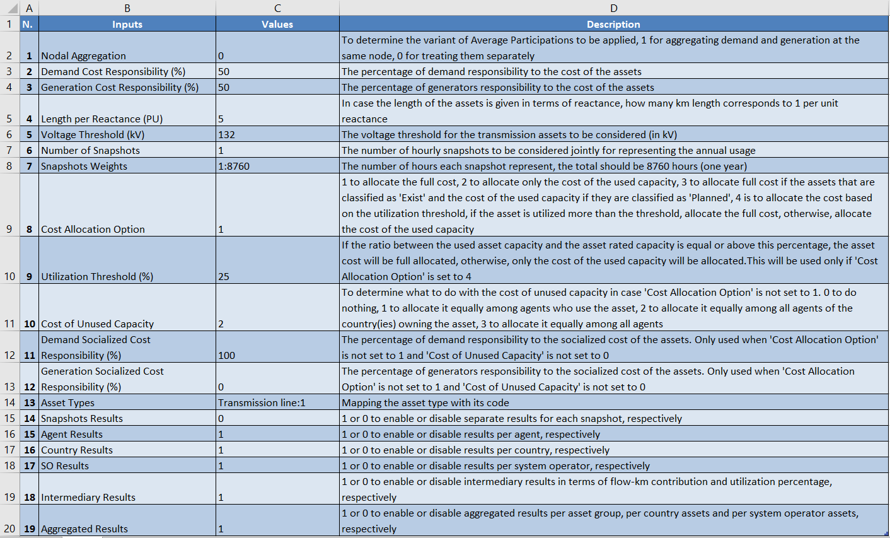

.. InfraFair documentation master file, created by Mohamed A.Eltahir Elabbas

##########################################
 Input Data
##########################################

The model input files must be stored in two .xlsx files. The first file should contain the network data and 
**must contain three tabs that are named exactly as in the figure below**. The data to be included in each tab is explained
in the following sections.

The second file should contain the control input variables that have different functionalities, as explained in the 
last section of this page.

Flow input data
===============

The flow input data consists of the list of all the assets represented in the network and the flow (in MW, MVAR or MVA)
in each asset per snapshot. The model accepts all the assets that can be represented as a line connecting two 
nodes in the network. The name of the asset must be **[Node A]-[Node B]**. The name of the nodes **must be numerical**
and each node must have a unique numerical ID. Additionally, the sign of the value of the flow represents the direction
of flow; if it is a positive value, it means the flow is from Node A to Node B. If the value is negative and the
name is the same, **[Node A]-[Node B]**, it means the flow is going from Node B to Node A. Below is a screenshot of a sample
of the flow input data. 

.. Note::
    For the readability of the code, all the names of the columns (underlined in yellow) **must be exactly the same** as shown in the different tabs.
    Additionally, all the columns that indicates snapshot-wise data **must include a suffix** that indicates the snapshot 
    number (as highlighted by a red rectangle) in their name. Moreover, the number of these columns **must correspond to 
    the number of snapshots** indicated in the control input variable (see the subsection below). Finally, the first column 
    (highlighted by an orange rectangle) in all the tabs **must not have a header name** and **must contain a number sequence** 
    to be used as an index.

Network input data
==================

The network input data consists of the list of all the nodes in the network and their corresponding generation (injection)
and demand (withdrawal) (in MW, MVAR or MVA) in the different snapshots. Each node must be associated with a certain country, and it 
can also be (optionally) associated with a system operator (SO). In order to reflect the **prosumer behaviour**, 
demand values can be negative, unlike generation values. In this case, negative demand will be given a special
account in the results (see :doc:`8_Output_Results`). 

.. Note::
    The electrical three-winding transformers are given special treatment. In order to include them in the model, 
    they must be represented by a **virtual node** that connects the three winding nodes, i.e., each three-winding transformer is 
    represented by a set of three lines. Some windings of the same transformer may belong to a different SO, and, therefore, 
    when the SO information is included, it **must be added as two columns**: SO 1 and SO 2. SO 2 must only have values 
    for the virtual nodes representing the three-winding transformers or other assets that require the same treatment. Naturally, 
    the virtual nodes must not have generation and demand values, as is the case for node 3 in the figure below.  

Assets attributes input data
============================

The assets attributes input data essential consists of the list of assets, with the same naming convention explained above, and 
the type of these assets (according to the "Asset Types" control input variable). If no further information was added, the 
model outputs will only consist of the tracked flow. The model accept other optional data that will be incorporated in the 
outputs automatically. The acceptable data are:
    
    * Capital investment of the asset (in kUS$).
    * Asset rated capacity (in MW, MVAR or MVA).
    * Asset length (in km).
    * Asset voltage (in kV).
    * Classification of whether the asset "Exist" or is "Planned".
    * Classification of whether the asset is regional or non-Regional, 1 or 0, respectively.
    * Asset ownership provided in four columns: the name of SO Owner 1 and 2, and their ownership percentages.
    * Asset reactance (in per unit)

.. Note::
    The units presented in this document are based on the electrical infrastructure. For other infrastructure, the equivalent 
    units should be used with the same magnitude. 

    If SO data is provided in the network input data, the model will automatically assign the asset ownership with the assumption 
    of 50-50% ownership for the shared assets. This will, however, be overwritten if the asset ownership is provided in the assets 
    attributes input data.  

Control input variables
=======================

This file defines variables that are used by the code to perform different functionalities. These are explained in the figure 
below. Note that the cell format of the variables **must be set to Number**, except the variables **'Snapshots Weights' and 
'Asset Types'must be set to Text**.

