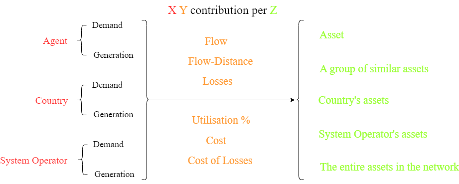

.. InfraFair documentation master file, created by Mohamed A.Eltahir Elabbas

##########################################
 Output Results
##########################################

The output of InfraFair is a series of .csv files. The name of each file indicates the type 
of results it contains. The general format of the names is **X Y contribution per Z**, X being 
the type of user or a group of users, Y being the type of contribution it makes, and Z being the 
asset or a group of assets. The figure below shows the different combinations of the three elements.  

Flow results
============
The flow results are the basic results of the model upon which all the other results are automatically 
calculated when their relevant optional data is given and enabled. 
They contain the tracking of the flow that network users induce in the assets based on the energy they 
produce or consume. The model tracks the entire flow of every asset, both to generators (upstream) and 
demand (downstream). Therefore, 100% of the flow in every asset is allocated to generators producing it, 
and 100% of the same flow is allocated to demand consuming it. 

Usage results
=============
The usage results are calculated when data on the length of the assets is provided in the Assets attributes input data. 
A flow of 100 MW does not make the same use of an asset that is 10 km long and another one that is 100 
km long. The model provides the usage results in terms of flow :math:`\cdot` distance (1000 or 10000 MW :math:`\cdot` km).

Utilisation results
===================
The utilisation results are calculated when data on the rated capacity of the assets is provided in the Assets attributes input 
data. The results indicate the percentage of the flow allocated to a network user (or a group of users) to 
the rated flow of the asset (or a group of assets). 

Cost results
============
The cost result is calculated when data on the cost of the assets, besides the rated capacity, is provided in the Assets 
attributes input data. The cost responsibilities in the Control input variables determine how much of the total cost will 
be allocated to the demand and generators. This percentage of the total cost is then allocated to the different demand and 
generators proportional to their asset utilisation. 

Losses results
==============
The losses results are calculated when data on the losses of each asset is provided in the flow input data. 
The losses are allocated to agents using the same contribution factor of the flow. For instance, assuming that the losses in a line 
that has 100 MW flow are 0.1 MW, if an agent is responsible for 40 MW flow on this line, it will be allocated 0.04 MW of the losses
in this line.